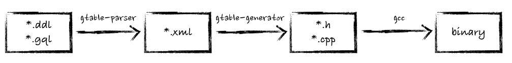

# what is gtable

gtable(GaloisTable) is a low-latency in-menory database engine implement by c++ for relational data storage especially for advertisement data. Support SQL like pre-compiled query language GQL. You can embed gtable into any c++ project.

# what is gtable-generator

gtable-generator is a tool for translating *.ddl.xml file inito *.h/*.cpp file.


# install

Installation dependency:
* go1.14+

```
$ go get github.com/galois-advertising/gtable-generator
```

# usage

First, you should use `gtable-parser` to parse `Data Definition Language` file (*.ddl) to xml file just like:

```
$ python ddl2xml.py user.ddl /path/to/user.ddl.xml
```

```
$ gtable-generator -i /path/to/*.ddl.xml -o /path/to/output
```